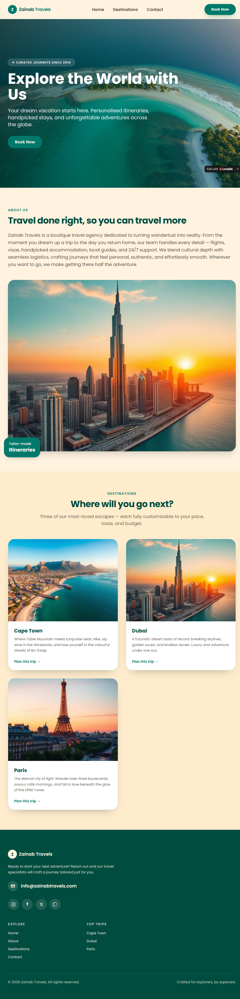
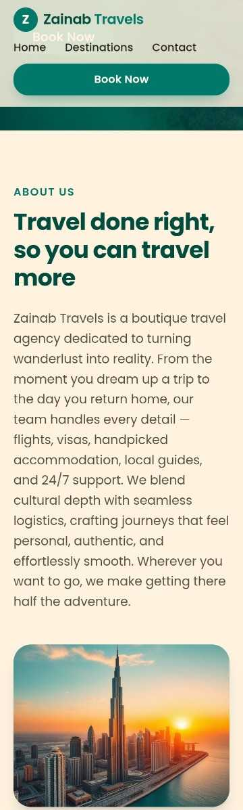

# Landing Page - OIBSIP WebDev Level 1 Task 1

**Name:** Zainab Adilu
**Domain:** Web Development & Designing
**Task Folder:** OIBSIP_WebDev_Task1

**Objective:** To build a visually polished static landing page for a travel brand to learn HTML/CSS layout, responsiveness and branding.

**Tools Used:** HTML5, CSS3, Google Fonts (Poppins), Unsplash images, VS Code, GitHub Pages.

**Steps Performed:**
1. Designed layout with navbar, hero, destinations, why choose us, testimonials, footer
2. Built structure with HTML5 semantic tags
3. Styled with CSS3 Flexbox and Grid for responsiveness
4. Added consistent color palette and typography
5. Pushed to GitHub OIBSIP repo and hosted on GitHub Pages

**Outcome:** A fully responsive landing page for "Zainab Travels" hosted live.

**How to run:** Open index.html in any browser
**Live:** https://zainadilouw.github.io/OIBSIP/WebDev-L1-LandingPage/
### Screenshots

