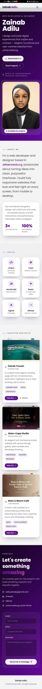

# Portfolio - OIBSIP WebDev Level 1 Task 2

**Objective:** To create a personal portfolio website showcasing my skills, projects and contact information.

**Tools Used:** HTML5, CSS3, JavaScript, Google Fonts, GitHub Pages

**Steps Performed:**
1. Created sections: Home, About, Skills, Projects, Contact
2. Added smooth scroll navigation
3. Made skills grid and project cards
4. Made it responsive for mobile and desktop
5. Hosted on GitHub Pages

**Outcome:** Live portfolio website ready for resume and LinkedIn.

**Live:** https://zainadilouw.github.io/OIBSIP/WebDev-L1-Portfolio/

## Screenshot

