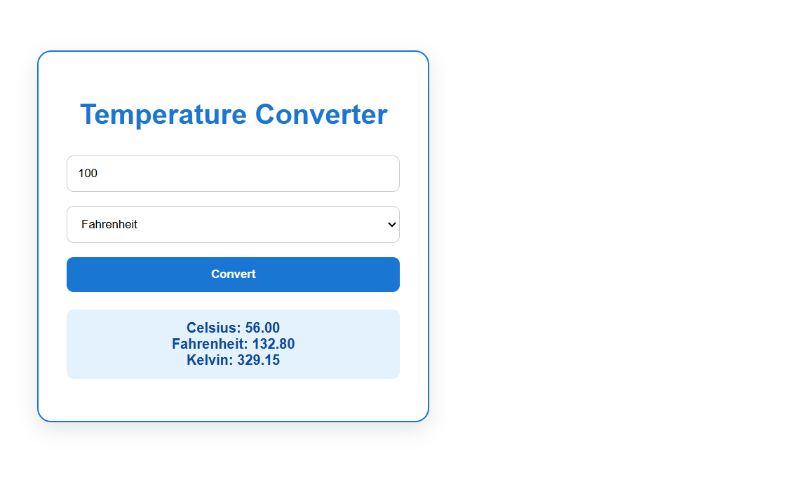
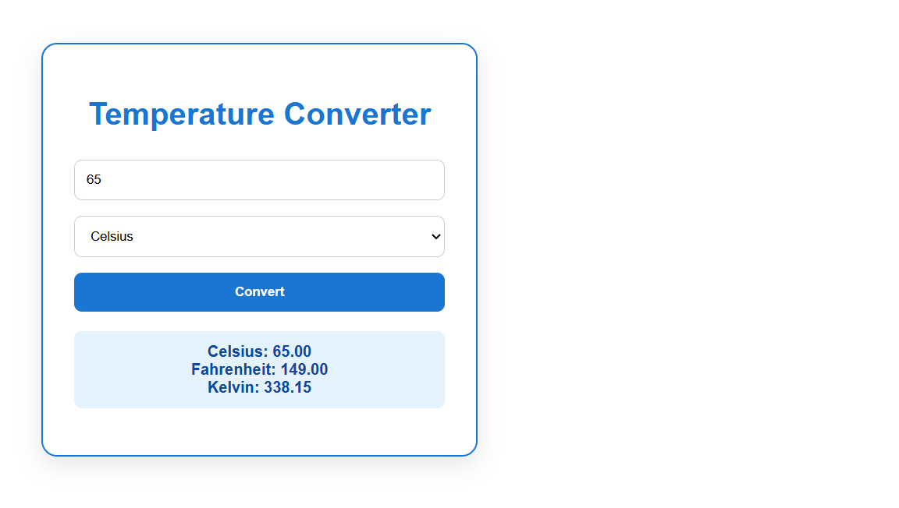

# Temperature Converter - OASIS INFOBYTE Level 1 Task 3

Simple converter built with HTML, CSS, JavaScript.

### Features
- Converts between Celsius, Fahrenheit, Kelvin
- Clean blue UI with validation
- Instant result: e.g. 100°C = 212°F = 373.15K

### How to use
1. Enter temperature value
2. Select From and To units
3. Click Convert

### Screenshot

Live: Open index.html in browser
Author: ZainAdilouw
